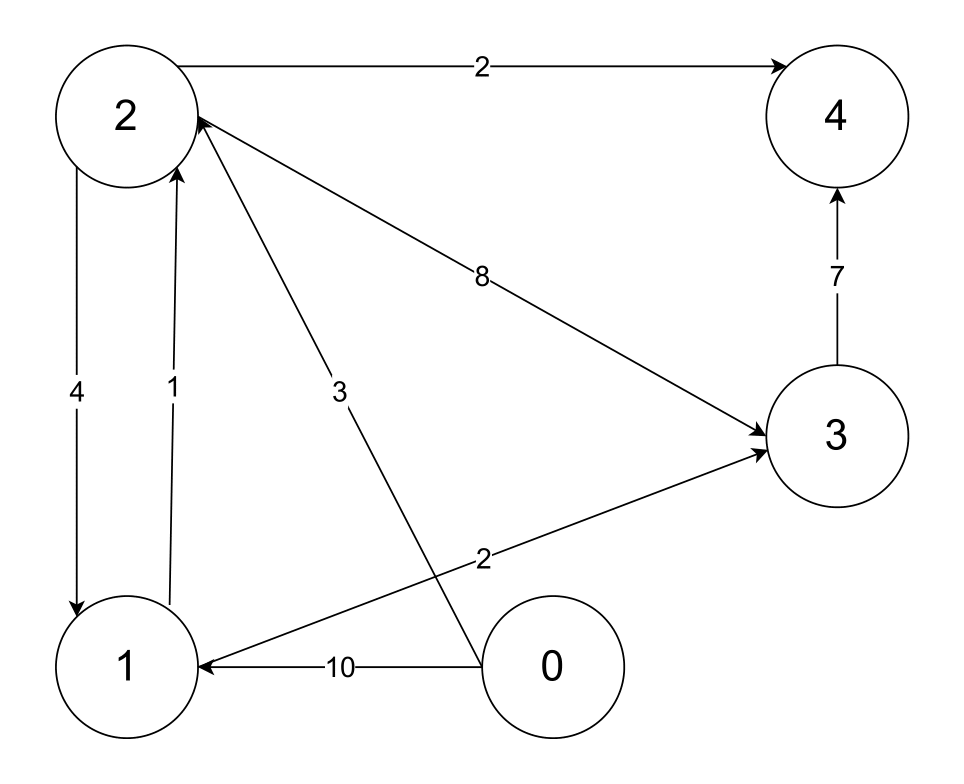
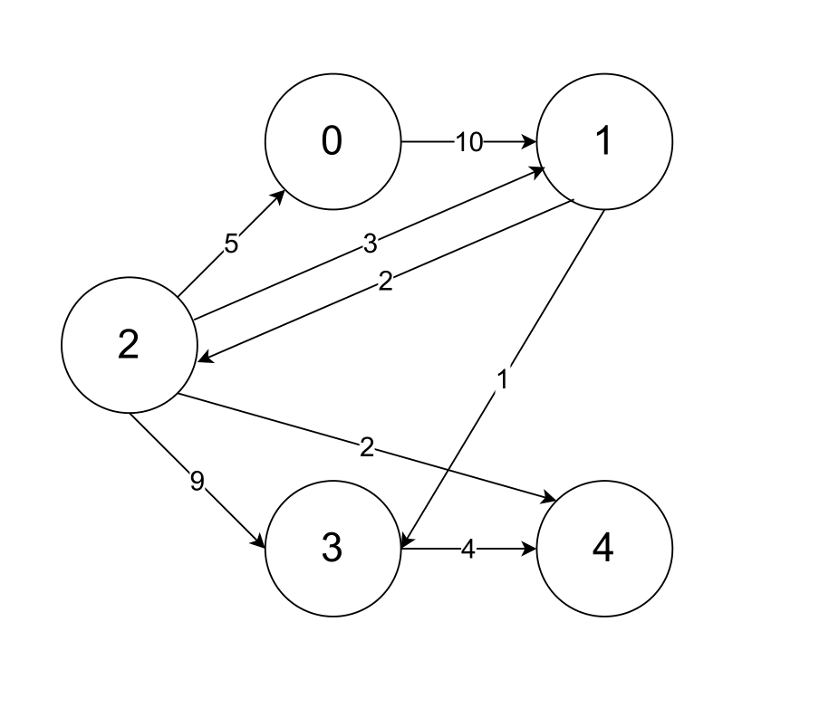

```markdown
# Dijkstra Shortest Path (C Implementation)

This project implements **Dijkstra's algorithm** to find the shortest paths from a **single source vertex** to **all other vertices** in a **weighted, directed graph**.

The implementation features **custom-built data structures** to mimic C++ STL functionality in pure C:
* `vector_int`: A dynamic array similar to `std::vector<int>`.
* `priority_queue`: A binary min-heap similar to `std::priority_queue`.

The graph is **0-indexed**, and all vertex IDs are in the range: `0` to `n-1`.

---

## Project Structure
```text
├── djikstra.c
├── vector_int.h
├── vector_int.c
├── priority_queue.h
├── priority_queue.c
├── graph1.txt
├── graph2.txt
├── graph3.txt

```

### File Descriptions

#### `djikstra.c`

Main file of the project. Responsible for:

* Reading graph data from input files
* Initializing the graph adjacency lists
* Running Dijkstra’s algorithm using the custom Priority Queue
* Printing shortest path distances
* Cleanly freeing all dynamically allocated memory

#### `vector_int.c / .h`

Implementation of a custom dynamic array in C.

* **Features:** Automatic resizing, memory management.
* **Functions:** `init_vector`, `push_back`, `clear_vector`.

#### `priority_queue.c / .h`

Implementation of a Binary Min-Heap to optimize Dijkstra's algorithm to **O(E log V)**.

* **Features:** Dynamic resizing, efficient `bubble_up` and `bubble_down` operations.
* **Functions:** `pq_push`, `pq_pop`, `pq_top`, `pq_empty`.

#### `graph*.txt`

Test graph inputs.

* `graph1.txt` – Directed graph example
* `graph2.txt` – Undirected graph example (edges explicitly duplicated)
* `graph3.txt` – Directed graph example

#### Visual Representations of the given graphs

<p><b>Graph1</b></p>


<p><b>Graph2</b></p>


<p><b>Graph3</b></p>


---

## Input Format

The input files follow this strict format:

```text
n m
v1 u1 w1
v2 u2 w2
...
vm um wm

```

Where:

* `n` – Number of vertices
* `m` – Number of edges
* `(v, u, w)` – Edge from vertex `v` to vertex `u` with weight `w`

---

## Technical Details

* **Efficiency:** The algorithm uses a Min-Heap (Priority Queue) to select the next closest node in **O(log N)** time, avoiding the O(N) linear scan of naive implementations.
* **Memory Safety:** The project includes checks for memory allocation failures and properly frees all resources to prevent leaks.
* **Lazy Deletion:** The priority queue implementation handles "stale" nodes by ignoring popped elements if a shorter path to that node has already been found.

---

## Compilation

You must compile all source files together. Use `gcc`:

```bash
gcc djikstra.c vector_int.c priority_queue.c -o main

```

**Run the executable:**

```bash
./main
# On Windows: main.exe

```

```

```